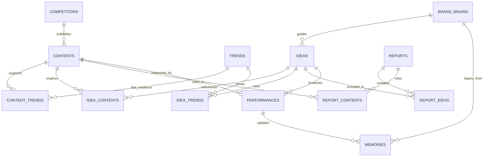

# INSight OS Database Architecture

## 0. Architecture Freeze

Sprint 2 starts with **Data Model Freeze**.

Reason:

After Sprint 2, database, API, Prompt, Workflow, Brand Brain, Memory, and Performance modules will reference each other. Late structural changes will be expensive.

This document freezes the first system data model.

## 1. North Star

INSight OS helps commercial real estate teams make better content decisions, not just generate more content.

Every table and relation should support better decisions:

- What happened?
- Why does it matter?
- Is it right for this brand?
- What should the team do next?
- What evidence supports the recommendation?

## 2. Entity List

Frozen entities:

- Content
- Competitor
- Trend
- Idea
- Report
- BrandBrain
- Memory
- Performance

All primary keys use UUID.

## 3. ER Diagram



## 4. Table Freeze

### 4.1 contents

Purpose:

Stores all source material: WeChat articles, Xiaohongshu posts, news, videos, campaigns, events, exhibitions, and market intelligence.

Key fields:

- `id`: UUID primary key
- `title`: content title
- `content_source`: article / post / video / campaign / event / exhibition / news
- `platform`: WeChat / Xiaohongshu / news / video / offline / other
- `source_name`: account, media, project, or publisher
- `source_type`: media / competitor / brand / news / user_import
- `competitor_id`: optional relation to competitors
- `url`: unique source URL when available
- `author`
- `published_at`
- `collected_at`
- `summary`
- `raw_text`
- `cover_image`
- `tags`
- `keywords`
- `city`
- `business_area`
- `category`
- `matched_brands`
- `suitable_for`
- `heat_score`
- `brand_fit_in77`
- `brand_fit_in88`
- `innovation_score`
- `execution_score`
- `ai_reason`
- `evidence`
- `content_status`: new / parsed / analyzed / selected / published / archived

Indexes:

- `url`
- `published_at`
- `content_status`
- `platform`
- `city`
- `category`
- `competitor_id`

### 4.2 competitors

Purpose:

Stores commercial projects, media accounts, and key competitors.

Key fields:

- `id`
- `name`
- `city`
- `type`
- `platform`
- `account_url`
- `tags`
- `priority`
- `ai_score`
- `created_at`

Indexes:

- `name`
- `city`
- `type`
- `priority`

### 4.3 trends

Purpose:

Stores topic trends and lifecycle judgments.

Key fields:

- `id`
- `keyword`
- `period`
- `count`
- `growth_rate`
- `lifecycle`: rising / peak / declining / outdated
- `score`
- `should_follow`
- `insight`
- `recommendation`
- `created_at`

Indexes:

- `keyword`
- `period`
- `score`
- `created_at`

### 4.4 ideas

Purpose:

Stores AI-generated and human-curated content ideas.

Key fields:

- `id`
- `title`
- `project`: in77 / in88 / other
- `angle`
- `outline`
- `suggested_platforms`
- `visual_suggestion`
- `brand_suggestion`
- `publish_timing`
- `priority`
- `reason`
- `decision`: recommend / discuss / hold / reject / rewrite / archive
- `confidence`
- `explainability`
- `status`: draft / discussed / selected / scheduled / published / archived
- `brand_brain_id`
- `created_at`

Indexes:

- `project`
- `priority`
- `status`
- `decision`
- `created_at`

### 4.5 reports

Purpose:

Stores weekly and monthly reports.

Key fields:

- `id`
- `title`
- `report_type`: weekly / monthly / campaign
- `week_start`
- `week_end`
- `markdown_content`
- `pdf_url`
- `ppt_url`
- `status`
- `created_at`

Indexes:

- `report_type`
- `week_start`
- `week_end`
- `created_at`

### 4.6 brand_brains

Purpose:

Stores brand knowledge that operations teams can update without changing code.

Prompts should not be stored in database. Prompts stay in Git under `packages/prompts/`.

Key fields:

- `id`
- `project`
- `positioning`
- `keywords`
- `avoid_words`
- `preferred_titles`
- `copy_tone`
- `visual_style`
- `content_columns`
- `audience_profile`
- `brand_partners`
- `kpi_preference`
- `content_ratio`
- `version`
- `updated_at`

Indexes:

- `project`
- `version`
- `updated_at`

### 4.7 memories

Purpose:

Stores content experience, not raw content.

Key fields:

- `id`
- `project`
- `memory_type`: column / node_review / success_reason / failure_reason / comment_insight
- `related_topic`
- `related_date`
- `related_content_id`
- `insight`
- `recommendation`
- `avoid_repeat`
- `reusable`
- `confidence`
- `updated_at`

Indexes:

- `project`
- `memory_type`
- `related_topic`
- `related_date`

### 4.8 performances

Purpose:

Stores real post-publication performance.

Key fields:

- `id`
- `project`
- `platform`
- `content_id`
- `idea_id`
- `publish_date`
- `reads`
- `likes`
- `saves`
- `comments`
- `shares`
- `engagement_rate`
- `comment_keywords`
- `kpi_result`
- `updated_at`

Indexes:

- `project`
- `platform`
- `publish_date`
- `content_id`
- `idea_id`

## 5. Relation Tables

Many-to-many relations:

- `content_trends`
- `idea_contents`
- `idea_trends`
- `report_contents`
- `report_ideas`

These tables must use UUID foreign keys.

## 6. Minimal v0.2 API Freeze

v0.2 only needs three Content Library APIs:

```text
POST /content/import
GET  /content
POST /content/analyze
```

### 6.1 POST /content/import

Purpose:

Import content from CSV, pasted text, manual entry, or later integrations.

Minimum fields:

- title
- content_source
- platform
- source_name
- source_type
- url
- author
- published_at
- raw_text

Result:

- Records are saved with `content_status = new`.

### 6.2 GET /content

Purpose:

List and filter content.

Filters:

- platform
- content_source
- content_status
- city
- category
- competitor_id
- published_at range

### 6.3 POST /content/analyze

Purpose:

Run AI analysis on one or more content records.

Output:

- summary
- tags
- keywords
- scores
- evidence
- recommendation
- `content_status = analyzed`

## 7. Prompt Storage Rule

Prompts must not be stored in database.

Prompts are product logic and must be version controlled in Git:

```text
packages/prompts/
```

Brand Brain is different. Brand Brain is business knowledge and should be database-backed so operators can update it later.

## 8. Change Control

After this freeze:

- Field additions require migration notes.
- Field removals require product approval.
- Relation changes require architecture review.
- Prompt changes go through Git.
- Brand Brain changes can happen through database or admin UI.

